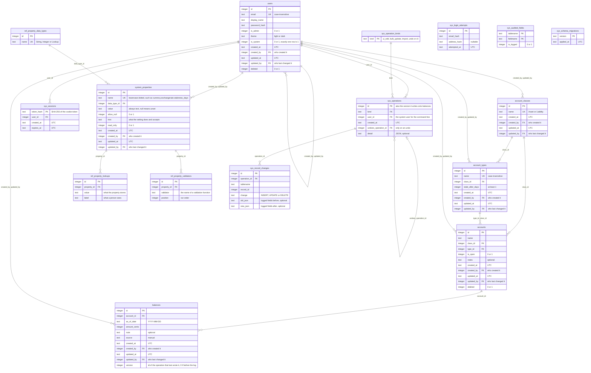

# Northstar: database schema

The SQLite schema as the migrations in `northstar/migrations/` build it. The migrations are the source of truth, and `tests/test_schema_diagram.py` fails when this diagram and a migrated database disagree about tables, columns, types, keys or relationships, so a schema change cannot ship without updating it. The rules the data must obey are in `spec.md`.

```mermaid
erDiagram
    account_classes ||--o{ account_types : "class_id"
    account_classes ||--o{ accounts : "class_id"
    account_types ||--o{ accounts : "type_id, class_id"
    accounts ||--o{ balances : "account_id"
    users ||--o{ sys_sessions : "user_id"
    users ||--o{ account_classes : "created_by, updated_by"
    users ||--o{ account_types : "created_by, updated_by"
    users ||--o{ accounts : "created_by, updated_by"
    users ||--o{ balances : "created_by, updated_by"
    users ||--o{ users : "created_by, updated_by"
    users ||--o{ system_properties : "created_by, updated_by"
    ref_property_data_types ||--o{ system_properties : "data_type_id"
    system_properties ||--o{ ref_property_lookups : "property_id"
    system_properties ||--o{ ref_property_validators : "property_id"
    users ||--o{ sys_operations : "user_id"
    sys_operation_kinds ||--o{ sys_operations : "kind"
    sys_operations |o--o{ sys_operations : "undoes_operation_id"
    sys_operations ||--o{ sys_record_changes : "operation_id"

    account_classes {
        integer id PK
        text name UK "Asset or Liability"
        text created_at "UTC"
        integer created_by FK "who created it"
        text updated_at "UTC"
        integer updated_by FK "who last changed it"
    }
    account_types {
        integer id PK
        text name UK "case-insensitive"
        integer class_id FK
        integer stale_after_days "at least 1"
        text created_at "UTC"
        integer created_by FK "who created it"
        text updated_at "UTC"
        integer updated_by FK "who last changed it"
    }
    accounts {
        integer id PK
        text name
        integer class_id FK
        integer type_id FK
        integer is_open "0 or 1"
        text notes "optional"
        text created_at "UTC"
        integer created_by FK "who created it"
        text updated_at "UTC"
        integer updated_by FK "who last changed it"
        integer deleted "0 or 1"
    }
    balances {
        integer id PK
        integer account_id FK
        text as_of_date "YYYY-MM-DD"
        integer amount_cents
        text note "optional"
        text source "manual"
        text created_at "UTC"
        integer created_by FK "who created it"
        text updated_at "UTC"
        integer updated_by FK "who last changed it"
        integer version "id of the operation that last wrote it, 0 if before the log"
    }
    users {
        integer id PK
        text email UK "case-insensitive"
        text display_name
        text password_hash
        integer is_admin "0 or 1"
        text theme "light or dark"
        integer is_system "0 or 1, exactly one row is 1"
        text created_at "UTC"
        integer created_by FK "who created it"
        text updated_at "UTC"
        integer updated_by FK "who last changed it"
        integer deleted "0 or 1"
    }
    system_properties {
        integer id PK
        text name UK "lowercase dotted, such as currency.exchangerate.staleness_days"
        integer data_type_id FK
        text value "always text, null means unset"
        integer allow_null "0 or 1"
        text hint "what the setting does and accepts"
        integer read_only "0 or 1"
        text created_at "UTC"
        integer created_by FK "who created it"
        text updated_at "UTC"
        integer updated_by FK "who last changed it"
    }
    ref_property_data_types {
        integer id PK
        text name UK "String, Integer or Lookup"
    }
    ref_property_lookups {
        integer id PK
        integer property_id FK
        text value "what the property stores"
        text label "what a person sees"
    }
    ref_property_validators {
        integer id PK
        integer property_id FK
        text validator "the name of a validation function"
        integer position "run order"
    }
    sys_sessions {
        text token_hash PK "SHA-256 of the cookie token"
        integer user_id FK
        text created_at "UTC"
        text expires_at "UTC"
    }
    sys_login_attempts {
        integer id PK
        text email_hash
        text address_hash "nullable"
        text attempted_at "UTC"
    }
    sys_operation_kinds {
        text kind PK "ui_edit, bulk_update, import, undo or cli"
    }
    sys_operations {
        integer id PK "also the version it writes onto balances"
        text kind FK
        integer user_id FK "the system user for the command line"
        text created_at "UTC"
        integer undoes_operation_id FK "only on an undo"
        text detail "JSON, optional"
    }
    sys_record_changes {
        integer id PK
        integer operation_id FK
        text tablename
        integer record_id
        text change "INSERT, UPDATE or DELETE"
        text old_json "logged fields before, optional"
        text new_json "logged fields after, optional"
    }
    sys_audited_fields {
        text tablename PK
        text fieldname PK
        integer is_logged "0 or 1"
    }
    sys_schema_migrations {
        text version PK
        text applied_at "UTC"
    }
```

## Conventions

- Money is integer cents. A balance date is a calendar date, `YYYY-MM-DD`, with no timezone. Row timestamps are UTC text, `YYYY-MM-DDTHH:MM:SSZ`.
- `is_open` and `is_admin` are 0 or 1, because SQLite has no boolean type.
- `sys_schema_migrations` is created by the migration runner in `northstar/db.py`, not by a migration file. Releases before 0.2 called it `schema_migrations`, and the runner renames it (keeping its rows) the first time a newer version starts, after a backup.
- A table that starts with `sys_` is written by the application for itself: it has no audit columns and is never logged. Every other table has the four audit columns (except a `ref_` table, below), and `created_by` and `updated_by` point at `users`. Rows that existed before the audit columns were added, and rows made by the command line, are authored by the system user: the one `users` row with `is_system = 1`, which nobody can sign in as.
- A table that starts with `ref_` is loaded by a migration and never written at run time: it has no audit columns, is never logged, and the writer refuses it. `account_classes` is the same kind of table but predates the prefix, so it keeps its audit columns.
- `live_accounts` and `live_balances` are views: the accounts that are not deleted, and the balances of those accounts. All reads go through them, and a test fails on a direct read of `accounts` or `balances`. Anything that rebuilds either table must drop both views first and create them again afterwards, because SQLite cannot rename a table while a view refers to it.
- Every household table uses `AUTOINCREMENT`, so the id of a deleted row is never given to another row.
- The change log is `sys_operations` (one row per user action that makes a logged change), `sys_record_changes` (one row per record it changed, with the logged fields as JSON) and `sys_audited_fields` (which fields are logged). `sys_record_changes.record_id` and `tablename` name any household record, so there is no foreign key to it. See "Change log" in `spec.md`.
- `sys_login_attempts` has no relationships on purpose: it keeps only hashes of the email and the address, never the typed values.

## What the diagram cannot show

A person checks these against the migrations, because the test cannot read them from the diagram.

| Table | Constraint |
|---|---|
| `account_classes` | Exactly two rows, Asset (1) and Liability (2), inserted by the first migration. |
| `account_types` | `UNIQUE (id, class_id)`, which is the target of the composite key from `accounts`. The first migration also inserts the 11 starting types. |
| `accounts` | `FOREIGN KEY (type_id, class_id)` references `account_types (id, class_id)` with `ON UPDATE RESTRICT ON DELETE RESTRICT`, so an account's type always belongs to its class, and a type in use can be neither deleted nor moved to another class. |
| `accounts` (name) | Unique index `accounts_name_unique` on `name COLLATE NOCASE`, only `WHERE deleted = 0`: a name is unique ignoring ASCII case among accounts that are not deleted, open or closed. A deleted account frees its name. |
| `balances` | `UNIQUE (account_id, as_of_date)`: one balance per account per date. `as_of_date` must be a valid date. Deleting an account cascades to its balances. |
| `users` | `deleted` is 1 for a user who was deleted: the row stays, so the author columns that name them keep working, and adding their email again reactivates it. `is_system` is 1 for exactly one row, enforced by the partial unique index `users_one_system`. The `created_by` and `updated_by` columns of every household table reference it. |
| `system_properties` | `name` is lowercase dotted segments, at least two, each starting with a letter (a `CHECK`). `value` is null or 1 to 256 characters, and `hint` is 1 to 256. The rows are loaded by migrations: no endpoint adds or deletes one. |
| `ref_property_lookups` | `UNIQUE (property_id, value)`. At most 20 rows per property, checked by a test. Deleting a property deletes its rows. |
| `ref_property_validators` | `UNIQUE (property_id, validator)` and `UNIQUE (property_id, position)`. `validator` is a key of `VALIDATORS` in `northstar/system_properties.py`, checked by a test. Deleting a property deletes its rows. |
| `sys_sessions` | Deleting a user cascades to their sessions. Index `sys_sessions_user_id` on `user_id`. |
| `sys_login_attempts` | Indexes on `(email_hash, attempted_at)` and `(address_hash, attempted_at)`. |
